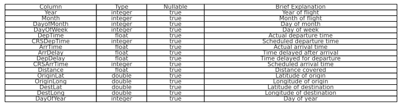
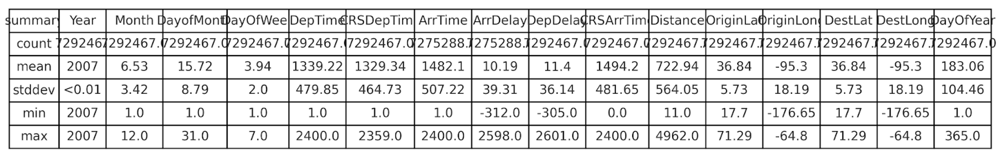
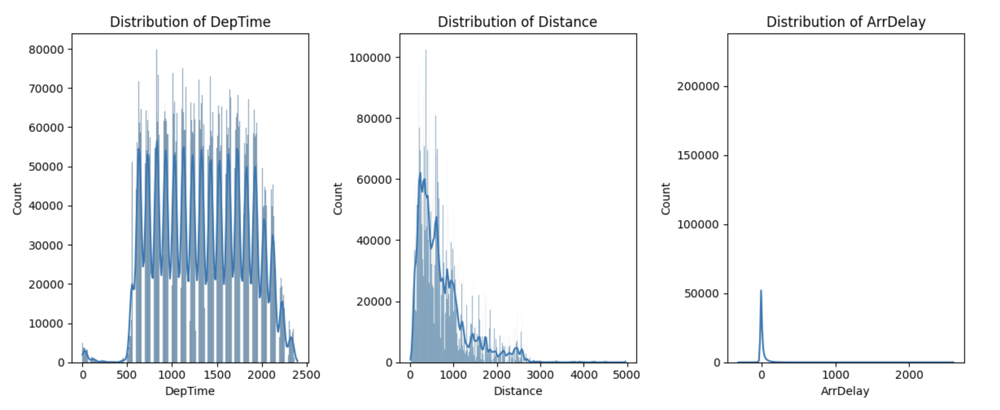
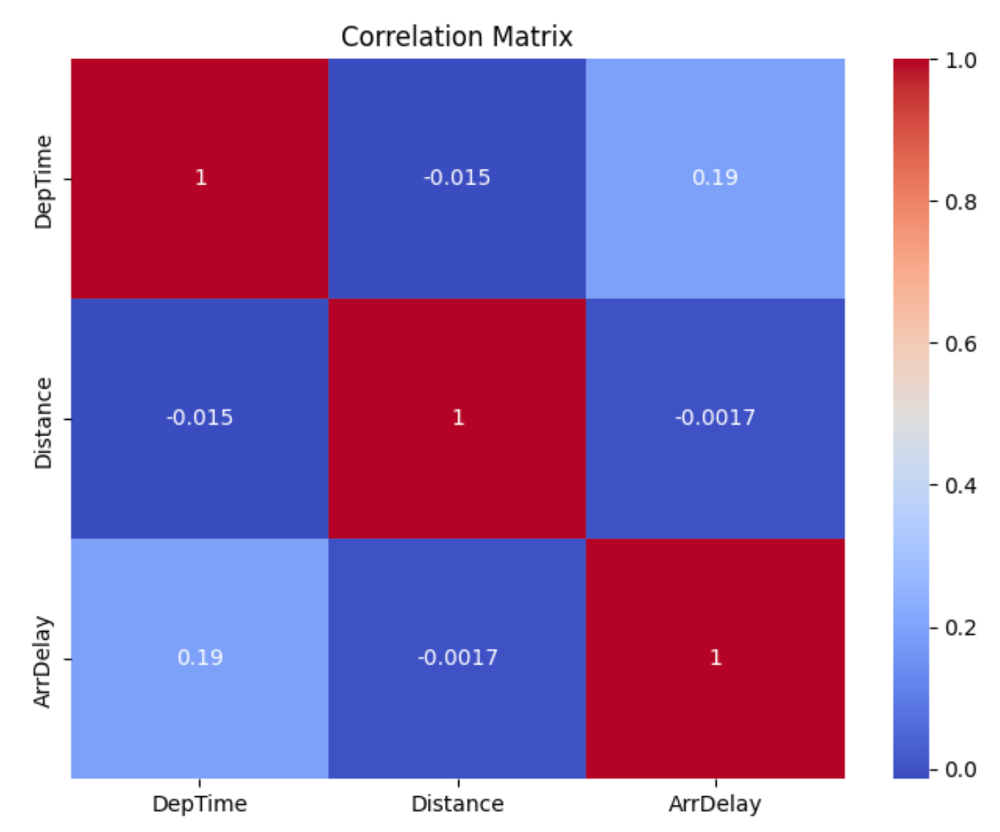

# Flight Delay Estimation- A Big Data ML Project

    

## Project Overview
This project employs machine learning and PySpark to predict flight arrival delays using a comprehensive 2007 U.S. flight dataset. Focusing on enhancing airline operational efficiency and passenger experience, the project explores models like Random Forest and Linear Regression, evaluated by RMSE and R² metrics. The transition from GitHub user data to flight data analysis highlights our commitment to tackling real-world challenges in the aviation industry.

## Demo 
[Hugging Face Spaces Demo](https://huggingface.co/spaces/sinpo/Flight-Delay-Estimation)
### Purpose
The goal of this demo is to showcase how machine learning can be used to predict flight delays. Users can input flight details, and the model will predict the delay duration. This tool is particularly useful for travelers, airline companies, and anyone interested in understanding the factors influencing flight delays.

### How It Works
The demo is built using a Scikit-Learn model and deployed via a Gradio interface. Users can input relevant flight details, and the model will output a delay prediction. The model considers various factors, including time of departure, scheduled departure times, and distance.

### Input Fields
- **Month (1-12)**: Numeric representation of the month.
- **Day of Month (1-31)**: Numeric day within the month.
- **Day of Week (1=Monday, 7=Sunday)**: Numeric representation of the day of the week.
- **Departure Time (HHMM format)**: Time of departure in 24-hour format.
- **Scheduled Departure Time (HHMM format)**: Scheduled departure time in 24-hour format.
- **Departure Delay (minutes)**: The delay in departure time from the scheduled time, in minutes.
- **Distance (miles or km)**: The flight distance.

### Instructions
1. Enter the flight details in the respective fields.
2. Click on the "Predict" button to see the predicted delay.
3. The predicted delay duration will be displayed in the output box.

### Notes
- This demo is a simplified version and uses a smaller dataset for demonstration purposes.
- The predictions made by this tool are based on historical data and should be used as estimates.

# Project Documentation

**Data Source:** Airline Flight Data: 120 million records of flight arrival and departure details for all commercial flights within the USA from October 1987 to April 2008. [https://dataverse.harvard.edu/dataset.xhtml?persistentId=doi:10.7910/DVN/HG7NV7](https://dataverse.harvard.edu/dataset.xhtml?persistentId=doi:10.7910/DVN/HG7NV7)

**Data Used:**

- 2007.csv
- airports.csv

## 1. **Introduction and Motivation**

### **1.1. Introduction:**

In the dynamic realm of air travel, the ability to predict and mitigate delays is paramount for airlines and passengers. Delays in flight arrivals can lead to a cascade of consequences, affecting operational efficiency, customer satisfaction, and overall industry performance. This data analysis project aims to delve into the intricacies of flight delays, utilizing machine learning techniques to predict the arrival delay of airplanes.

### **1.2. Motivation:**

The motivation behind this project stems from the significant impact that flight delays have on various stakeholders within the aviation industry. For airlines, delays can result in increased operational costs, disrupted schedules, and decreased customer satisfaction. On the other hand, passengers experience inconvenience, potential missed connections, and added stress. Moreover, understanding the factors contributing to delays allows airlines to implement proactive measures for better operational planning and resource allocation.

By leveraging the power of machine learning, this project seeks to unravel the patterns and relationships hidden within a comprehensive dataset containing crucial information about flights. Through predictive modeling, we aim to develop accurate models capable of forecasting the arrival delays of airplanes. The potential benefits of such predictions are multifaceted, ranging from improved resource management for airlines to enhanced passenger travel experiences.

### **1.3. Project Significance:**

This project aims to provide significant insights to aid in optimizing airline operations and contribute to the broader goal of enhancing the overall efficiency and reliability of air travel. The ability to predict arrival delays empowers stakeholders to take proactive measures, reducing the ripple effects of delays and fostering a more seamless travel experience.

As we explore various machine learning models, including Random Forest, Linear Regression, gradient-boosted trees, and Polynomial Regression, we aim to identify the model that best captures the complex relationships within the data. By evaluating these models based on Root Mean Squared Error (RMSE) and R2, we aim to provide insights into the effectiveness of different approaches for predicting flight delays.

### **1.4. Project Overview:**

The project utilizes PySpark, a robust open-source framework for big data processing, to handle and analyze a substantial dataset containing detailed flight information. Through a series of data preprocessing steps, feature engineering, and the implementation of machine learning pipelines, we construct models capable of making accurate predictions about arrival delays.

In the following sections, this report will explain our analysis's methodology, results, and implications. By the conclusion, we hope to offer a comprehensive understanding of the factors influencing flight delays and provide valuable insights that can be translated into actionable strategies for the aviation industry.

### **1.5. Adaptation of Project Scope:**

Our initial project proposal centered around utilizing GitHub user data, envisioning an analysis exploring patterns and trends within the developer community. However, upon closer inspection of the available data, it became evident that the dataset needed more granularity and diversity to explore our intended questions. Acknowledging the importance of working with robust and relevant data, we shifted our focus entirely. The allure of delving into flight delays, with its multifaceted impact on the aviation industry and passengers, captured our interest. This shift provided a more compelling and real-world application of the machine learning concepts learned throughout the course. It allowed us to contribute meaningfully to optimizing airline operations and passenger experiences. Our commitment to addressing practical challenges led us to embrace this change in direction, and we are confident that the insights gained will provide valuable perspectives for the aviation industry stakeholders.

## **2. Data Collection**

### **2.1. Source of the Dataset**

The dataset employed in this project originates from dataverse.harvard.edu, focusing on flight data spanning from 1987 to 2008. In making a reasonable selection, the decision was reached to utilize flight data exclusively from 2007. This choice was informed by the completeness and recency of the data for that specific year, ensuring a robust foundation for the analysis. This strategic decision aims to leverage the most recent and comprehensive dataset available for the entire year, enhancing the relevance of the analysis to contemporary air travel conditions.

### **2.2. Dataset Composition**

The dataset encompasses a comprehensive array of features, providing a rich source of information for the analysis. Key attributes include temporal details such as the year, month, day of the month, day of the week, and scheduled departure and arrival times. Additionally, the dataset comprises information about the flight itself, such as the carrier code, flight number, tail number, departure and arrival delays, origin and destination airport codes, distance traveled, and various other factors affecting flight operations.

### **2.3. Dataset Transformation**

The raw dataset underwent a series of preprocessing steps to facilitate practical analysis. Irrelevant columns were excluded, and missing values were addressed to ensure data integrity. The final dataset contains crucial features for predicting flight delays, including temporal aspects, geographical information about airports, and key operational metrics. This will be explained further in the Data Transformations section.

### **2.4. Rationale for Dataset Selection**

The decision to shift the project's focus from GitHub user data to flight delays was prompted by the need for a more granular and diverse dataset. Recognizing the importance of robust and relevant data in the analysis, the team found exploring flight delays particularly compelling, as it felt like a real-life application we are all interested in.

## **3. Data Inspection and Validation**

### **3.1. Dataset Overview**

The dataset under consideration spans from 1987 to 2008, but for this analysis, only data from the year 2007 was utilized. The dataset comprises diverse attributes, including temporal, operational, and geographical features, providing a comprehensive foundation for predicting flight delays.

### **3.2. Data Validation Steps**

- **Handling Missing Values:** Irrelevant columns were dropped, and efforts were made to retain data completeness. Rows with null or NaN values in the target column (ArrDelay) were removed, ensuring the reliability of the target variable.
- **Temporal Validation:** Given the focus on 2007, validation steps were taken to confirm that the dataset only includes data from this specific year. This ensures the accuracy and relevance of the temporal information.
- **Categorical Columns:** Categorical columns, such as UniqueCarrier and CancellationCode, were not included in the initial set of features. While these columns could offer valuable insights, their inclusion would require additional preprocessing steps, such as one-hot encoding.
- **Exploratory Data Analysis (EDA):** Although the EDA section is commented out in the provided code, it serves as a critical step for understanding the distribution of numeric features and identifying potential correlations. EDA insights contribute to informed feature selection and preprocessing decisions.

## **4. Data Filtering**

In selecting features for our machine learning models, thoughtful consideration of the dataset's attributes was paramount. The chosen features capture various aspects influencing flight delays, ensuring the models are equipped to make accurate predictions. The selected columns include:

- **Temporal Features:**
    - **Year, Month, DayofMonth, DayOfWeek:** To capture time-related patterns affecting flight delays.
- **Operational Features:**
    - **DepTime, CRSDepTime, ArrTime, CRSArrTime:** Actual and scheduled departure and arrival times are crucial for understanding delays.
    - **DepDelay:** Departure delay serves as a critical predictor.
    - **Distance:** The distance traveled influences the overall flight duration.
- **Geographical Features:**
    - **OriginLat, OriginLong, DestLat, DestLong:** Latitude and longitude information for the origin and destination airports, potentially affecting regional weather patterns and airport-specific operational challenges.
- **Additional Operational Information:**
    - **Canceled:** A binary indicator of whether the flight was canceled, impacting the target variable.
    - **TaxiIn, TaxiOut:** Taxi-in and taxi-out times reflect ground operations.
- **Target Variable:**
    - **ArrDelay:** The arrival delay in minutes is the focal point for prediction.

## **5. Data Transformation**

- **Handling Missing Values:** Imputation was employed to replace missing values with the mean of each feature. This ensures the preservation of data integrity.
- **Combining Airport Data:** To enrich the dataset with geographical information, airport data was joined based on the origin and destination airport codes. This resulted in creating new columns such as OriginLat, OriginLong, DestLat, and DestLong, providing insights into the geographical aspects of flight operations.
- **Casting Non-Numerical Data:** To facilitate modeling, non-numerical data in columns like ArrTime, DepDelay, DepTime, ArrDelay, and Distance was cast to the FloatType. This conversion ensures these values are represented as numeric data, enabling mathematical operations and standardization.
- **Creating DayOfYear Variable:** A new variable, DayOfYear, was introduced by combining the Year, Month, and DayofMonth columns. This date-time feature offers a more holistic representation of temporal information, capturing patterns throughout the year.
- **Scaling:** StandardScaler was applied to standardize numeric features, ensuring that all variables contribute equally to the model. Scaling is particularly crucial for algorithms sensitive to the magnitude of input features, promoting fair and unbiased model training.
- **Feature Engineering - Polynomial Expansion:** Polynomial expansion was applied to selected features, introducing higher-order terms to capture potential non-linear relationships. This step enhances the model's capacity to understand intricate patterns within the data, improving its predictive accuracy.
- **Chi-Squared Feature Selection:** A chi-Squared Selector was employed to choose a subset of features before polynomial expansion. This selective process helps prevent potential overfitting, as not all parts may contribute equally to the model's predictive power.

The data transformation process involved a series of intentional steps to enhance the dataset's richness and prepare it for machine learning model training. Combining airport data, casting non-numerical data to a numeric format, creating a new date-time variable, and employing advanced feature engineering techniques reflect a thoughtful approach to capturing relevant information and ensuring the model's effectiveness in predicting flight delays. Each decision in the transformation process aligns with the overarching goal of creating a robust and comprehensive dataset for accurate predictive modeling.

## **6. Exploratory Data Analysis**

### **6.1. Data Summary**

**Data Schema Overview**

*Figure6.1. Schema Details: A table outlining the data types and descriptions of the columns in the flight dataset.*

**Summary Statistics**

*Figure6.2. Descriptive Statistics: A table summarizing the count, mean, standard deviation, minimum, and maximum values for selected columns in the dataset.*

Our dataset now includes observations from 2007, with 7,292,467 records, indicating a substantial increase from the previous year's dataset. This expansive dataset covers various flight metrics, such as timings, delays, geographic coordinates, and more. Initial statistical summaries showcase the comprehensive range of values across key flight-related metrics like 'DepTime,' 'ArrDelay,' and 'Distance.'

### **6.2. Distribution Analysis**

**Distribution of Key Flight Metrics**

*Figure6.3. Histograms of Departure Time, Distance, and Arrival Delay: Visualizing the frequency distributions within the flight data.*

The distribution patterns for 'DepTime,' 'Distance,' and 'ArrDelay' offer insights into the operational characteristics of flights:

- **Departure Time (DepTime)**: The histogram displays a multimodal distribution, signifying multiple peak departure times throughout the day. These peaks likely correspond to the rush hours at airports, with notable early morning and late afternoon clusters, indicating the typical start and end times of daily flight schedules.
- **Distance**: The flight distribution remains right-skewed, suggesting that shorter domestic flights are more frequent than long-haul international flights. This skewness hints at a higher volume of short-distance travel for business or regional connectivity.
- **Arrival Delay (ArrDelay)**: A pronounced right skew in the arrival delay distribution implies that most flights are on time or face minor delays. However, the long tail to the right indicates occasional flights with significant delays, which could be a focal point for further analysis to identify underlying causes.

### **6.3. Correlation Matrix**

**Correlation Matrix**

*Figure6.4. Heatmap of Correlation Coefficients: Showcasing the relationship between departure time, distance, and arrival delay*

Our updated correlation matrix for the 2007 dataset provides the following insights:

- A noticeable correlation (0.19) between 'DepTime' and 'ArrDelay' reinforces the notion that departures might be prone to increased arrival delays later in the day.
- The correlation between 'Distance' and 'ArrDelay' remains weak, implying that the flight distance has no significant linear correlation with the delays experienced upon arrival.

### **6.4. Insights and Hypotheses**

Given the EDA observations:

- The departure time is a relevant predictor for arrival delays, likely influenced by factors like air traffic congestion during peak hours and the ripple effect of delays from earlier flights.
- The insignificant correlation between 'Distance' and 'ArrDelay' suggests that external factors, such as air traffic control, weather variations, and airline operational efficiency, maybe more critical in influencing delays.
- The geographic coordinates provided in the dataset (latitude and longitude for origin and destination) present an opportunity to explore spatial patterns in flight delays, potentially leading to insights into how regional factors impact flight punctuality.
- Considering the volume and patterns observed, we might explore time-series analysis for forecasting and anomaly detection to enhance operational decision-making for airlines and airports.

The findings from the 2007 dataset will guide our approach to modeling and feature engineering, emphasizing temporal and possibly spatial variables to predict delays more accurately. This analysis sets the stage for targeted strategies to mitigate delay factors and improve airline performance.

### **7. Model Building and Results**

In our project's "Model Building and Results" phase, we focus on developing and assessing various predictive models using PySpark to understand their effectiveness in forecasting flight delays. This involves constructing four different types of models - Random Forest, Linear Regression, gradient-boosted trees, and Polynomial Regression, each offering a unique approach to prediction. We first prepare our data by imputing missing values and standardizing features to ensure consistency. The data is then split, with 75% used for training the models (where they learn from the data) and the remaining 25% for testing their accuracy. The performance of each model is evaluated using two key metrics: Root Mean Squared Error (RMSE), which measures the average deviation of the model's predictions from actual delays, and R2, which indicates how well the model explains the variation in flight delays. Lower RMSE and higher R2 values signify better model performance. After the evaluation, we compare each model's RMSE and R2 scores to determine the most effective predictor of flight delays, concluding the process by shutting down the Spark session and analyzing our findings to draw conclusions about the best-performing model.

The choice of a 5th-degree polynomial for the Polynomial Linear Regression model was an attempt to capture more intricate, non-linear relationships in the data, which can be crucial for accurately predicting flight delays. This degree was selected to balance complexity with the risk of overfitting, allowing the model to consider interactions up to the fifth power without becoming too specific to the training data.

The superior performance of Polynomial Linear Regression and standard Linear Regression in the dataset stems from the inherent linearity of the relationships between features like departure time, distance, and flight number with the target variable, arrival delay. These models excel in environments where relationships are linear or can be approximated by polynomial terms. Polynomial Regression can capture linear and specific non-linear interactions up to the fifth degree. In contrast, RandomForestRegressor and GBTRegressor, while robust in handling complex non-linear patterns, might have been less effective if the underlying data patterns were predominantly linear. Additionally, the StandardScaler used in the preprocessing pipeline could have enhanced the performance of the linear models, which are sensitive to the scale of input features, unlike the tree-based models. This scenario suggests that the dataset's key factors influencing flight delays align more closely with linear assumptions, making Polynomial and standard Linear Regression more suitable choices.